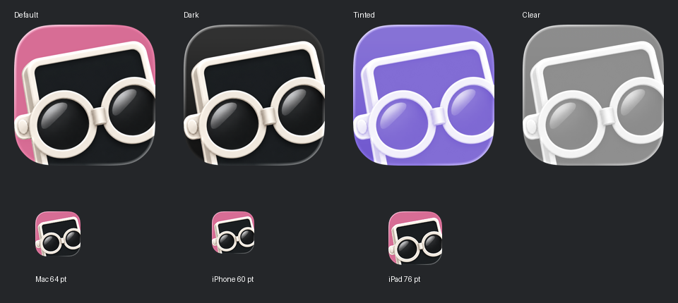

# Screenpunk app icon

`Screenpunk.icon` is the approved shared Icon Composer master for macOS and
iOS/iPadOS. Both XcodeGen app targets compile it as one resource and select
`Screenpunk` as their app icon name. Do not import its internal PNG/JSON as
separate resources or replace it with a masked preview PNG.

Build with Xcode 26 or newer. Xcode generates legacy flat icons for the existing
iOS/iPadOS 16+ and macOS 14+ deployment targets; these minimums are unchanged.
On supported systems the icon uses native Liquid Glass rendering.

Open the bundle in Icon Composer to edit it. The original character is a single
1254 px raster layer, centered at 100% for the operator-selected closer crop.
The background is native #E66596. Specular is enabled; neutral shadow is 20%;
blur and translucency are disabled to preserve the dark lenses and screen.
Existing character shading is baked into the raster.

Approval and image integrity are recorded in [provenance](../PROVENANCE.md).
See [Apple's integration documentation](https://developer.apple.com/documentation/xcode/creating-your-app-icon-using-icon-composer).

## Composer preview

This is a review image, not a build resource.
